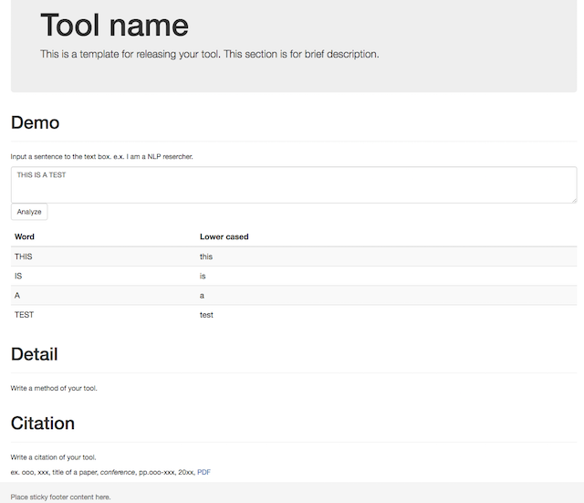

# NLP Web Demonstration Template
This template helps releasing own research for NLP researcher.

Knowledge requirements for customizing the template:
- basic Python
- basic HTML
- basic javascript (jquery)
- basic web application



# Usage

## Run the example demonstration

```sh
git clone https://github.com/kanjirz50/web-nlp-interface.git
cd web-nlp-interface
gunicorn -b 127.0.0.1:8080 -w 1 index:app
```

You can see the example demonstration on the browser, 127.0.0.1:8080.

** Notice: Firewall port:8080 have to be opened for this demonstration. **

## Run own application

### Put your application

If your application is developed by Python code, put your codes to under the libs directory.

If your application is not developed by Python, there are two ways. One is using submodule, the other is build a Python interface.


### Modify a view page and js file for showing your application result

A data format of example demonstration is simple.
Input is text, output is list[[Word, lowercased word], ...].
You have to modify rendering codes.

- `static/js/analyze.js`
  - unnamed function: submit text data using GET request
  - writeTable function: write result to table in a html file

- `views/contents/demo.html`
  - Result is shown as a table. Please modify a number of column and column name.

# Deployment
We can use some servers, [Bottle-Deployment](http://bottlepy.org/docs/dev/deployment.html).

# Template structure
Coming soon...

# Examples
- [Snowman](http://snowman.jnlp.org/english)
  - [Screen capture](https://a13ed10a-a-dee0cc0a-s-sites.googlegroups.com/a/jnlp.org/snowman/snowman/雪だるまH28.4.8.PNG)
  - Japanese word analyzer
  - This analyzer is Web-based system.
- [Vietnamese morphological analyzer](http://160.16.58.116/vietnamese/morph)
  - Provide joint word segmentation and part-of-speech tagging.

# Acknowledgment
This demonstration templates uses the following open source software:
- [Bottle](http://bottlepy.org/docs/dev/index.html) for all of web system
- [Bootstrap](http://getbootstrap.com/) for html styles

# License
MIT License, see LICENSE for details.
